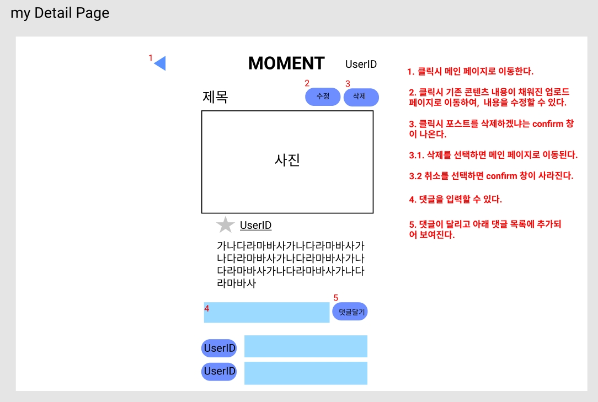

# Moment

## Team Trip-a-Duck

조장 : 김효식
조원 : 김민성, 송진영

## Introduction

- 여행 사진과 글을 포스팅하여 추억을 공유하는 플랫폼 서비스

## 기획 의도

- 코로나로 인해 여행을 가지 못하는 상황인 만큼, 다른 사람들의 여행 기록을 볼 수 있는 사이트를 제작하고자 함.
- 다른 사람의 여행 기록을 보고, 나의 여행 기록을 공유함으로써 여행에 대한 needs를 충족시킬 수 있음.

## Main Service

- 국가별로 필터링하여 해당 국가 여행 포스트를 볼 수 있는 기능.
- 국가를 선택하여 여행 사진과 내용을 포함한 포스트를 업로드하는 기능.
- 다른 유저의 포스트의 좋아요 버튼을 누를 수 있는 기능
- 다른 유저의 포스트에 댓글 달기 기능
- 유저가 올린 포스트 수정 가능
- 유저가 올린 포스트 삭제 가능

## 목표

- JS 비동기 처리의 이해(promise)
- event 처리 학습
- html, css 복습

## usecase

## UI

## storyboard

- main page

- upload page

- detail page
- mine

- other

## Tech

- HTML
- CSS(SASS)
- JS
